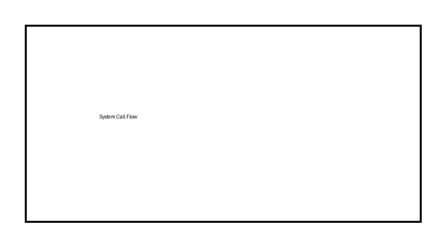

# 📘 **OSP1: Process & Thread Management — Foundations with OS Context**

## **PART A — Operating System Context (Silberschatz Chapter 1 & 2)**

> **Reference**: *Operating System Concepts* — Silberschatz, Galvin, Gagné
> **Purpose of this part**:
> Build the *mental ground* required to understand **processes** later.
>
> If you skip this part, Chapter 3 will feel like magic.
> If you understand this part, Chapter 3 will feel *inevitable*.

---

## 📂 Folder Structure (Strict — follow this)

```
OSP1/
│
├── OSP1_Process_Thread_Management.md
│
└── images/
    ├── bare_metal_vs_os.png
    ├── os_as_resource_manager.png
    ├── layered_os_view.png
    ├── user_kernel_mode.png
    ├── cpu_mode_switch.png
    ├── interrupt_trap_flow.png
    ├── system_call_flow.png
    ├── os_services_overview.png
```

I will reference images exactly like this:

```md

```

---

# A1. Before OS: How a Computer *Really* Starts and Runs

Let’s start **below** the OS.

### Power-on Reality (Hardware Truth)

When power is applied:

* CPU starts execution at a **fixed address**
* This address is defined by hardware / firmware
* No process
* No protection
* No scheduler
* No illusion

From your experience:

* STM32 → reset vector
* MIPS → fixed boot address

📌 **At this moment, there is NO operating system**

---

### What Exists at This Point?

Only:

* CPU
* Registers
* Memory
* Interrupt logic
* Some firmware / boot code

That’s it.

---

## A2. Bare-Metal Execution Model (Embedded World)

This is **your comfort zone**, so we use it as baseline.

### Characteristics

* One program
* One stack
* One PC
* One flow of execution

If your code does:

```asm
ADD R1, R2, R3
```

Nothing stops it.

If your code overwrites memory:

* System crashes
* No protection

📌 **Bare metal assumes the programmer is trusted**

---

### Why This Model Breaks on General-Purpose Systems

Now imagine:

* Browser
* Media player
* IDE
* Background services

All running together.

Questions arise immediately:

* Who owns the CPU now?
* Who owns RAM?
* What if one program misbehaves?

➡️ **Bare-metal model collapses**

---

## A3. Why an Operating System Exists (Real Reason)

The OS is **not** mainly for:

* UI
* Windows
* Menus

The OS exists to solve **three fundamental problems**:

### 1️⃣ Multiplexing

One hardware resource → many programs

### 2️⃣ Isolation

One program must not destroy another

### 3️⃣ Abstraction

Hide hardware complexity

---

## A4. OS as a Resource Manager

Think of the OS as a **strict traffic controller**.


### Managed Resources

| Resource    | Why Needs Management                    |
| ----------- | --------------------------------------- |
| CPU         | Only one instruction at a time per core |
| Memory      | Prevent overwrites                      |
| Disk        | Ordered access                          |
| I/O devices | Shared safely                           |

📌 Programs **never touch hardware directly**.

---

## A5. OS as an Illusion Builder (Very Important)

The OS lies — **on purpose**.

It tells each program:

* “You have the CPU”
* “You have memory”
* “You run alone”


This illusion is created using:

* Context switching
* Virtual memory
* Protection modes

---

## A6. CPU Privilege Levels (Critical Hardware Concept)

You already know this, but now we connect it to OS.

### CPU Has Modes

| Mode        | Allowed                 |
| ----------- | ----------------------- |
| User mode   | Normal instructions     |
| Kernel mode | Privileged instructions |

Privileged instructions include:

* Disable interrupts
* Access I/O ports
* Modify page tables
* Control MMU


📌 If user code could do these → **system destroyed**

---

## A7. Why Mode Separation Is Non-Negotiable

Imagine this in user mode:

```asm
MOV CONTROL_REGISTER, 0x0000
```

If allowed:

* Memory protection gone
* OS dead

So CPU enforces:

> “If you’re not kernel, you don’t do this.”

---

## A8. How Does CPU Switch Modes?

There are **only controlled doors**.

### Two Legitimate Ways

1. **Interrupts** (hardware-generated)
2. **Traps / System calls** (software-generated)


📌 User code **cannot jump into kernel mode freely**

---

## A9. Interrupts vs Traps (Clear Difference)

| Interrupt      | Trap (System Call)   |
| -------------- | -------------------- |
| External       | Intentional          |
| Hardware event | Software instruction |
| Unpredictable  | Controlled           |
| Example: timer | Example: `read()`    |


---

## A10. System Calls — Talking to the OS

A **system call** is:

> A controlled request by a user program asking the OS to do something privileged.

Examples:

* Create a process
* Read a file
* Allocate memory

---

### Assembly-Level View (MIPS-style)

```asm
li   $v0, SYS_READ
syscall
```

What happens:

1. CPU switches to kernel mode
2. Saves user context
3. Jumps to OS handler
4. OS does the work
5. Returns safely



---

## A11. Why APIs Exist Above System Calls

Direct system calls are:

* Dangerous
* Hardware-specific

So we use:

* C library
* POSIX
* Win32

Flow:

```
User program
 → Library function
   → System call
     → Kernel
```

📌 This hides OS internals from programmers.

---

## A12. Operating System Services (What OS Promises)

From Silberschatz Chapter 1:


### User-Oriented Services

* Program execution
* I/O operations
* File manipulation
* Communication
* Error detection

### System-Oriented Services

* Resource allocation
* Accounting
* Protection & security

📌 **All these services operate on ONE UNIT → the process**

---

## A13. Key Takeaway Before Moving Forward

Stop here and internalize this:

> The OS does **not** manage instructions.
> The OS manages **executions**.

That execution unit is what we will soon call:

> **a process**

---

## A14. Mental Bridge to Chapter 3 (DO NOT SKIP)

Before processes even appear:

You must already believe:

* Programs cannot run freely
* CPU must switch between executions
* State must be saved
* Memory must be isolated

📌 If any of this feels unclear → reread Part A

---

## 🧠 Summary of PART A (Context)

| Concept     | Meaning                             |
| ----------- | ----------------------------------- |
| OS          | Resource manager + illusion builder |
| User mode   | Restricted execution                |
| Kernel mode | Privileged execution                |
| Interrupt   | Hardware event                      |
| Trap        | Controlled OS entry                 |
| System call | Safe request to kernel              |

---


## **PART B — PROCESSES (Silberschatz Chapter 3)**

> **What this part answers**
> *“What exactly is the OS managing when it says it is managing a process?”*
>
> By the end of this part, you should be able to **explain a context switch verbally down to registers and memory**, without memorizing buzzwords.

---

## 📂 Images to keep in `/images` for this part

```
images/
├── process_vs_program.png
├── process_components.png
├── process_address_space_detailed.png
├── logical_vs_physical_memory.png
├── process_states_extended.png
├── pcb_full_layout.png
├── context_switch_timeline.png
├── timer_interrupt_context_switch.png
```

---

## B1. Program vs Process (This Confusion Must Die First)

### Program (Static Thing)

A **program** is:

* An executable file on disk
* Passive
* No registers
* No stack
* No execution

Example:

```text
a.out
hello.exe
firmware.bin
```

📌 A program **cannot run by itself**.

---

### Process (Living Thing)

A **process** is:

* A program **in execution**
* With **state**
* With **memory**
* With **OS tracking**


> **Key sentence (exam-safe)**
> A program is a passive entity stored on disk, whereas a process is an active entity representing the execution of a program together with its current state.

---

## B2. Why the OS Cannot Just “Run Programs”

From hardware point of view:

* CPU has:

  * One Program Counter
  * One register file per core

Yet OS must:

* Run *many* programs “at once”

➡️ **Impossible without saving and restoring state**

📌 This necessity **creates the concept of a process**

---

## B3. What Exactly Is a Process? (Real Definition)

A **process = 3 tightly bound things**


### 1️⃣ Address Space

### 2️⃣ CPU Execution Context

### 3️⃣ OS Metadata

We now expand **each one deeply**.

---

## B4. Process Address Space (Core Concept)

Each process believes it owns **all memory**.

Reality: it owns **none physically**.


```
High Address
┌────────────────────────┐
│ Stack                  │ ← function calls, locals
├────────────────────────┤
│ Heap                   │ ← malloc / new
├────────────────────────┤
│ Global / Static Data   │
├────────────────────────┤
│ Code (Text Segment)    │
└────────────────────────┘
Low Address
```

---

### Embedded vs OS Memory (Important Contrast)

| Embedded           | OS-based system    |
| ------------------ | ------------------ |
| Physical memory    | Virtual memory     |
| Absolute addresses | Virtual addresses  |
| One stack          | Per-process stacks |
| No isolation       | Strict isolation   |

📌 **MMU is the key hardware difference**

---

## B5. Logical vs Physical Memory (Why Isolation Works)

A process uses **logical (virtual) addresses**.

Hardware uses **physical addresses**.


Flow:

```
Process → Virtual Address
        → MMU
        → Physical Address
```

📌 OS controls the mapping.

This is why:

* One process cannot read another’s memory
* Faulty code does not crash the system

---

## B6. CPU Execution Context (Hardware-Level View)

When a process is running, the CPU holds:

* Program Counter (PC)
* General-purpose registers
* Stack Pointer (SP)
* Status / flags register

You already know these from MIPS.

📌 **This entire set = execution context**

---

### Critical Realization

If the OS wants to pause a process, it must save:

> **everything the CPU needs to resume execution**

Nothing less works.

---

## B7. Process States (Not Just Names — Meaning)


### The Five Core States

| State      | What it *really* means         |
| ---------- | ------------------------------ |
| New        | OS is creating data structures |
| Ready      | Has everything except CPU      |
| Running    | Instructions executing         |
| Waiting    | Blocked for I/O or event       |
| Terminated | Finished, cleanup pending      |

---

### Why “Ready” Exists

Because:

* CPU is busy
* Process *could* run
* But must wait

📌 Ready ≠ Waiting
Ready = waiting **for CPU**
Waiting = waiting **for event**

---

## B8. Process Control Block (PCB) — The Heart of Everything

> **If processes exist, PCB must exist.**


---

### What PCB Contains (Mapped to Hardware)

| PCB Field          | Hardware Meaning    |
| ------------------ | ------------------- |
| PID                | Process identity    |
| Program Counter    | Next instruction    |
| Registers          | CPU snapshot        |
| Stack Pointer      | Current stack       |
| Page table pointer | Address translation |
| Scheduling info    | Priority, state     |
| Open files         | Resource ownership  |

📌 **PCB is NOT optional**
No PCB → no multitasking

---

## B9. PCB vs Embedded Context Save

In embedded systems:

* You save registers manually in ISR

In OS:

* Kernel saves registers into PCB

Conceptually identical — **scale is different**.

---

## B10. Context Switching (The Most Important Mechanism)

A **context switch** happens when:

* CPU stops executing Process A
* Starts executing Process B


---

### Step-by-Step (Hardware Accurate)

1. Timer interrupt occurs
2. CPU switches to kernel mode
3. OS saves Process A context into PCB
4. OS selects Process B
5. OS loads Process B context from PCB
6. CPU resumes execution

📌 No magic. Just save & restore.

---

## B11. Timer Interrupt — The Enforcer

Without timer interrupt:

* One process could run forever


Timer interrupt guarantees:

> **OS regains control periodically**

This is how preemption works.

---

## B12. What EXACTLY Is Saved During Context Switch (Exam Gold)

### ❓ Question:

**What exactly is saved and restored during a process context switch?**

### ✅ Answer (Verbatim Safe)

> During a process context switch, the operating system saves the complete CPU execution context of the currently running process into its Process Control Block. This includes the program counter, general-purpose registers, stack pointer, processor status information, and memory management information such as page table references. The operating system then restores the saved context of the next scheduled process, allowing it to resume execution exactly from the point where it was previously interrupted.

---

## B13. Why Context Switching Is Expensive

Because OS must:

* Enter kernel mode
* Save many registers
* Change memory mappings
* Flush TLB
* Restore next process state

📌 Switching ≠ free

This is why:

* Too many processes hurt performance
* Threads exist (later topic)

---

## B14. Process Creation (Conceptual Only)

When OS creates a process:

1. Allocate PCB
2. Allocate address space
3. Load program code
4. Initialize registers
5. Set PC to entry point
6. Mark as Ready

📌 Embedded systems usually skip steps 1–4.

---

## B15. Process Termination (Cleanup Matters)

When process finishes:

* OS must:

  * Release memory
  * Close files
  * Remove PCB

Zombie processes happen when:

> Execution ended but PCB not yet removed

---

## B16. Pause and Think (Very Important)

Ask yourself:

> If OS did NOT store PC, what would happen?

Answer:

* Process would restart
* No continuation
* Multitasking impossible

📌 **PC is the soul of execution**

---

## B17. Mental Model You Should Lock In

> A process is a **paused or running movie**, and the PCB is the **bookmark + snapshot**.

---

## 🧠 PART B Summary (Condensed)

| Concept         | Core Idea            |
| --------------- | -------------------- |
| Process         | Execution + state    |
| PCB             | OS memory of process |
| Context switch  | Save & restore CPU   |
| Address space   | Memory illusion      |
| Timer interrupt | OS control           |
| Ready state     | Waiting for CPU      |

---


## **PART C — THREADS (Conceptual + Hardware-Grounded)**

> **Purpose of this part**
> Explain **why threads exist**, **what they really are**, and **why they are not “just faster processes.”**
>
> After this, you should *intuitively* know when threads help and when they hurt.

---

## 📂 Images to keep in `/images` for this part

```
images/
├── single_thread_process.png
├── multi_thread_process.png
├── thread_memory_model.png
├── thread_context_vs_process_context.png
├── thread_lifecycle.png
├── thread_vs_process_comparison.png
├── cache_sharing_threads.png
├── false_sharing_example.png
```

---

## C1. Why Processes Alone Are Not Enough

Let’s start with a **real limitation of processes**, not theory.

### Process-Only Model (What We Have So Far)

* Each process:

  * Own address space
  * Own PCB
  * Own memory mapping
* Context switching:

  * Expensive
  * Heavy (MMU, TLB, page tables)

Now imagine this program:

> A web browser tab:

* UI loop
* Network fetch
* Image decoding

If each task = separate process:

* Massive overhead
* Slow coordination
* Memory duplication

📌 **Processes are heavy-weight**

---

## C2. Key Insight That Leads to Threads

Ask this question carefully:

> Do *all* parts of a program really need **separate memory**?

Answer:

* ❌ No
* They usually want:

  * Same code
  * Same data
  * Different execution flows

➡️ **This insight creates threads**

---

## C3. What Is a Thread? (Precise Meaning)

> A **thread** is the **smallest unit of CPU execution**.

A process is a **container**.
A thread is a **flow of execution inside that container**.

---

### Single-Threaded Process


* One PC
* One stack
* One execution flow

---

### Multi-Threaded Process


* Multiple PCs
* Multiple stacks
* Shared memory

📌 One process → many threads

---

## C4. Thread Memory Model (CRITICAL)

This must be crystal clear.


### Shared Between Threads

* Code segment
* Heap
* Global/static data
* Open files

### Private to Each Thread

* Program Counter
* Registers
* Stack
* Thread ID

---

### Why Stack Must Be Private

Each thread:

* Calls functions independently
* Has its own local variables
* Has its own return addresses

If stacks were shared:

* Total chaos

📌 **One thread = one stack**

---

## C5. Thread Context vs Process Context

This is where **performance difference** comes from.


### Process Context Contains

* Registers
* PC
* Stack pointer
* Page table
* Address space info

### Thread Context Contains

* Registers
* PC
* Stack pointer

📌 **No memory mapping switch**

This is huge.

---

## C6. Why Thread Context Switching Is Cheaper

When switching threads **inside the same process**:

* No page table change
* No TLB flush
* Same address space
* Same memory cache

➡️ **Less hardware work**

This is the *only* reason threads can be faster.

---

## C7. Thread Lifecycle (Simpler Than You Think)


States are conceptually same as process:

* New
* Ready
* Running
* Waiting
* Terminated

Difference:

* Threads live **inside a process**
* If process dies → all threads die

---

## C8. User-Level vs Kernel-Level Threads (Conceptual Only)

### User-Level Threads

* Managed by library
* Kernel sees **one process**
* Fast creation
* Blocking system call blocks all threads

### Kernel-Level Threads

* Managed by OS
* Kernel schedules threads directly
* True parallelism on multi-core
* More overhead

📌 Modern OS → kernel-level threads

---

## C9. Threads vs Processes — The Truth Table


| Aspect         | Process   | Thread        |
| -------------- | --------- | ------------- |
| Address space  | Separate  | Shared        |
| Creation cost  | High      | Low           |
| Context switch | Expensive | Cheaper       |
| Isolation      | Strong    | Weak          |
| Communication  | IPC       | Shared memory |
| Failure        | Isolated  | Shared crash  |

---

## C10. Why Threads Are **NOT Always Faster** (CRITICAL)

This is an **exam favorite** and a **real-world trap**.

### Reason 1: Synchronization Overhead

Shared memory means:

* Locks
* Mutexes
* Semaphores

Each lock:

* Stops parallelism
* Adds latency

📌 Threads spend time **waiting**, not running

---

### Reason 2: Race Conditions

If two threads write:

```c
counter++;
```

Without protection:

* Incorrect results
* Hard-to-debug bugs

Processes don’t have this problem by default.

---

### Reason 3: Cache Contention


Threads:

* Share L1/L2 cache
* Can evict each other’s data

➡️ Performance drops.

---

### Reason 4: False Sharing (Very Important)


Two threads modify:

* Different variables
* Same cache line

Result:

* Cache invalidation storms
* Massive slowdown

📌 **This kills performance silently**

---

### Reason 5: Failure Propagation

If one thread:

* Segfaults
* Corrupts memory

➡️ Whole process dies

Processes isolate failures better.

---

## 🔥 VERBAL EXAM ANSWER (MEMORIZE)

### ❓ Why are threads not always faster than processes?

### ✅ Correct Answer

> Threads are not always faster than processes because although thread creation and context switching are cheaper, threads share the same address space, which introduces synchronization overhead, race conditions, cache contention, and false sharing. Additionally, a failure in one thread can crash the entire process. In many CPU-bound or highly synchronized workloads, these costs can outweigh the benefits of threads.

---

## C11. Threads and Your Embedded Background (Bridge)

In embedded systems:

* One execution flow
* Interrupts simulate concurrency
* Shared memory by default

Threads are like:

> **Multiple “main loops” sharing the same memory**

Difference:

* OS enforces scheduling
* Hardware enforces protection (between processes)

---

## C12. Important Boundary (DO NOT CROSS YET)

At this stage:

* You **do not** need:

  * Thread scheduling algorithms
  * APIs (`pthread`)
  * Language-specific behavior (Python GIL)

Those come **after** this chapter.

---

## C13. Mental Model That Must Stick

> **Process = house**
> **Thread = people living inside the house**

* People share rooms (memory)
* Each person has their own thoughts (PC, registers)
* One fire destroys the house (failure)

---

## 🧠 PART C Summary (Dense but Honest)

| Concept       | Core Idea          |
| ------------- | ------------------ |
| Thread        | Execution unit     |
| Process       | Resource container |
| Stack         | Thread-private     |
| Heap          | Process-shared     |
| Thread switch | Cheaper            |
| Safety        | Lower              |
| Speed         | Conditional        |

---

## 🧩 FINAL CHAPTER-LEVEL SUMMARY (OSP1)

You now understand:

* Why OS exists
* Why processes exist
* What PCB really stores
* How context switching works
* Why threads exist
* Why threads are dangerous if misused

This is **solid Chapter-1 mastery**.
