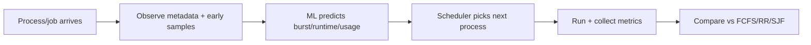
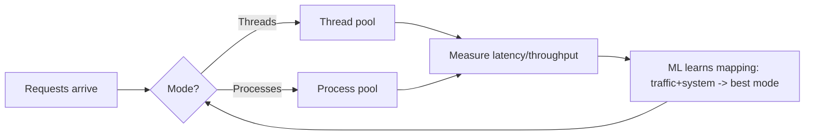
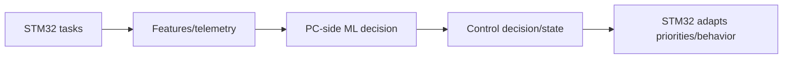
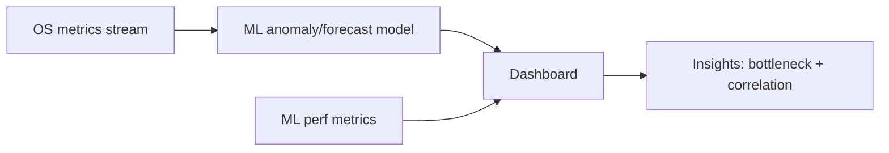

# CSE-323 (Operating Systems) + ML/AI Project Ideas (Project Galib)

> **Note:** This document is **restructured** for clarity **without removing any information**.  
> The **full original draft (verbatim)** is included at the end under **Appendix A**.

---

## Table of Contents

1. [Prologue (your goal)](#1-prologue-your-goal)
2. [Project A — ML-Aware CPU Scheduler](#2-project-a--ml-aware-cpu-scheduler)
3. [Project B — Concurrency Lab: ML Inference Server (Threads vs Processes)](#3-project-b--concurrency-lab-ml-inference-server-threads-vs-processes)
4. [Project C — Tiny RTOS on STM32 + PC-side ML Brain](#4-project-c--tiny-rtos-on-stm32--pc-side-ml-brain)
5. [Project D — Hybrid OS + AI + Monitoring Dashboard](#5-project-d--hybrid-os--ai--monitoring-dashboard--very-pitch-friendly)
6. [Comparison (all-out)](#6-comparison-all-out)
7. [Dataset Catalog (all datasets in one place)](#7-dataset-catalog-all-datasets-in-one-place)
8. [Appendix A — Original Draft (Verbatim)](#8-appendix-a--original-draft-verbatim)

---

## 1) Prologue (your goal)

Perfect — this is a **pitch-prep + deep understanding** request, not an implementation request. I’ll explain the **4 projects** in a way that lets you confidently talk to your teacher, answer *“what is new here?”*, *“why is this OS?”*, and *“what will I actually learn?”* — **without going into blueprints or code**.

I’ll cover for **each project**:

* What it *really* is (plain language)
* What makes it **novel / improved**
* How it is **clearly an OS project**
* What *you* learn as an AI-engineering-bound student
* How a teacher will *perceive* it

---

---

## 2) Project A — **ML-Aware CPU Scheduler**

### 1) Short 2–3 liners: what it does
Normally, an operating system schedules processes **without understanding what the process is doing**.
Your project explores:

> “What if the scheduler *understands* ML workloads and schedules them smarter?”

You run **ML jobs as processes**, and instead of blindly scheduling them, your system:

* observes job characteristics
* predicts how “heavy” a job is
* prioritizes jobs in a more intelligent way

### 2) What you need to do

<b>Click to expand (action list)</b>

* Implement a CPU scheduler simulation (or modify an existing simulator)  
* Represent ML workloads as processes (runtime, CPU burst pattern, memory usage patterns)  
* Train a model to predict runtime / CPU burst / resource usage  
* Compare your ML-aware policy with classic policies (FCFS, RR, SJF, Priority)  
* Evaluate fairness vs throughput vs latency (and show it with plots)

### 3) Why OS (and OS topics)
**Why OS:** This is literally the OS scheduler decision loop.  
**OS topics touched (explicit):**
* Process lifecycle (create, run, terminate)
* CPU scheduling policies
* Context switching overhead
* Fairness vs throughput
* Resource accounting
* **Strong OS Knowledge**  

ML is **just improving the scheduling policy**, which is core OS research territory.

### 4) ML level
**Medium**
* Supervised regression  
* Feature engineering from system logs  
* No deep learning required  

### 5) What you learn
* How schedulers actually affect performance
* Why ML workloads stress CPUs differently
* How AI systems behave under resource constraints

This directly prepares you for:
* distributed training
* MLOps
* cloud ML systems

### 6) ML model trained
**Predict a process/job’s CPU burst / runtime / resource usage** (so the scheduler can make smarter decisions than blind RR/FCFS).

### 7) Datasets (at least 3) — training data for the ML model
1. **Google Cluster Trace (Borg) — 2011 trace**

* What it is: anonymized logs of **jobs/tasks + scheduling events + resource usage** from a Google Borg cell over ~29 days.
* Why it fits: you can train to predict **task runtime**, **CPU usage**, **memory usage**, and even **queueing/wait time** using job/task metadata + early resource samples. ([GitHub][1])
* **Size:** ~**41 GB compressed** (trace is large; uncompressed is bigger) ([Emergent Mind][1])
* **What it contains:** job/task events + resource usage over time (great for learning “what should run next”)

2. **Alibaba Cluster Trace (ClusterData) — 2017/2018 traces**

* What it is: production cluster traces with multiple tables (machines, instances/tasks, usage, etc.) over days; very commonly used for **resource prediction** and scheduling research.
* Why it fits: similar to Google traces but from Alibaba; good for learning patterns of **CPU/memory/disk/network usage** and estimating future demand. ([GitHub][2])
* **Size:** ~**50 GB compressed**, **270+ GB uncompressed** ([AlibabaCloud][2])
* **What it contains:** workloads from ~4000 servers across ~8 days (good for scheduling + capacity planning)

3. **Microsoft Azure Public Dataset (VM utilization traces) — V1/V2**

* What it is: very large-scale Azure VM workload traces (millions of VMs, billions of utilization readings).
* Why it fits: excellent for training predictors of **CPU utilization time series** and “how heavy will this job be” style models (very scheduler/reclaimer relevant). ([GitHub][3])
* **Size:** ~**78.5 GB compressed** ([GitHub][3])
* **What it contains:** VM/resource traces useful for predicting usage, contention, and “noisy neighbor” effects

*(if you want a smaller preprocessed version)*  
4) **Derived Google task CPU CSV on Zenodo (preprocessed from Google cluster trace TRU table)**

* What it is: ready-made CSVs with timestamp + mean CPU usage derived from Google trace tables.
* Why it fits: saves time if you don’t want to parse the full schema at first. ([Zenodo][4])
*(Bonus, if you want something smaller: Azure VM Noise Dataset 2024 is ~277 MB.)* ([GitHub][4])

---

## 3) Project B — **Concurrency Lab: ML Inference Server (Threads vs Processes)**

### 1) Short 2–3 liners: what it does
You build a system that answers this OS question:

> “When many requests arrive, should we use threads or processes?”

You use **ML inference** as the workload, because:

* it’s CPU-bound
* it’s realistic
* it’s measurable

### 2) What you need to do

<b>Click to expand (action list)</b>

* Build a server that handles many requests
* Implement two modes:
  * multi-threaded
  * multi-process
* Measure latency, throughput, CPU usage
* Train ML to **predict which mode performs better**
* Automatically choose concurrency strategy under load

### 3) Why OS (and OS topics)
This project studies:

* context switching cost
* memory sharing
* synchronization overhead
* IPC cost
* **Strong** Knowledge required

**OS topics touched (explicit):**
* Threads vs processes
* Context switching cost
* Synchronization (locks/semaphores)
* Inter-process communication (IPC)
* Scheduling effects under load

ML is just the **payload**, not the focus.

### 4) ML level
**Medium**
* Classification / regression
* Traffic pattern → performance mapping

### 5) What you learn
* Why multithreading sometimes hurts performance
* How concurrency choices affect latency
* How real servers behave (very industry-relevant)

This maps directly to:
* API serving
* model deployment
* scalable AI systems

### 6) ML model trained
**Predict performance under load** (latency/throughput/errors) and choose **threads vs processes** based on request pattern and system conditions.

### 7) Datasets (at least 3) — training data for the ML model
1. **Uber microservice trace dataset (“The Tale of Errors in Microservices”)**

* **What it is:** ~**1.4 million** sanitized **microservice traces** collected at Uber and released with a research paper via Zenodo.
* **Why it fits:** excellent for training models on **latency prediction**, **error/SLO risk**, and adaptive decisions such as **choosing a concurrency strategy under load**.
* **Size:** ~**1.6–2.0 GB compressed**, ~**8–10 GB uncompressed**
* **What it contains:** request traces, latency distributions, error patterns, service-level interactions across a real production system

2. **WorldCup98 Web Server Logs**

* **What it is:** logs of **~1.35 billion HTTP requests** generated during the 1998 FIFA World Cup website operation, showing extreme bursty traffic.
* **Why it fits:** ideal for training ML models that predict **traffic spikes**, **QPS forecasting**, and **burst classification**, which directly informs thread vs process decisions.
* **Size:** ~**11–12 GB compressed**, **100 GB+ uncompressed**
* **What it contains:** timestamped HTTP requests, request paths, response codes, and client behavior over ~3 months

3. **NASA Kennedy Space Center HTTP logs (NASA-HTTP)**

* **What it is:** two months of real HTTP request logs collected from NASA’s Kennedy Space Center web servers.
* **Why it fits:** useful for learning **request-rate forecasting** and **arrival-pattern classification**, feeding decisions like concurrency model selection.
* **Size:** ~**20–25 MB compressed**, ~**200–250 MB uncompressed**
* **What it contains:** ~3.4 million HTTP requests with timestamps, URLs, and response information

4. **ClarkNet HTTP logs**

* **What it is:** HTTP access logs from ClarkNet, an early commercial ISP web server, collected over about two weeks.
* **Why it fits:** smaller than WorldCup98; excellent for **rapid prototyping** of traffic-pattern models and testing **generalization across sites**.
* **Size:** ~**10–15 MB compressed**, ~**120–150 MB uncompressed**
* **What it contains:** ~3.3 million HTTP requests with realistic but manageable traffic dynamics

*(Optional if you want “modern-scale” request data source)*  
5) **Wikimedia webrequest stream description (Wikitech)**

* **What it is:** Wikimedia’s live **webrequest stream**, containing hits to servers for HTML pages, images, APIs, mobile traffic, etc.
* **Why it fits:** represents **modern internet-scale traffic**, suitable for conceptual validation of ML-based traffic prediction and concurrency adaptation.
* **Size:** **Not fixed** — typically **100–500+ GB per day** depending on filters
* **What it contains:** streaming request logs in JSON/Parquet form, accessed via Wikimedia’s data platform rather than full downloads

---

## 4) Project C — **Tiny RTOS on STM32 + PC-side ML Brain**

### 1) Short 2–3 liners: what it does
You split intelligence and control:

* STM32 runs **real-time tasks**
* PC runs **ML decision logic**

This mirrors how **real embedded systems** work (drones, robots, IoT).

### 2) What you need to do

<b>Click to expand (action list)</b>

* Bring up a tiny RTOS (or a minimal scheduler) on STM32F103 “Blue Pill”
* Define multiple periodic tasks (sensor read, control loop, comms/logging)
* Feed sensor/features to PC-side ML (or run tiny inference on MCU if feasible)
* Use ML output to **adjust task behavior/priorities**
* Demonstrate timing correctness (deadlines, jitter) under different loads

### 3) Why OS (and OS topics)
You directly deal with:

* task scheduling
* interrupts
* task priorities
* timing constraints

That is **operating systems at hardware level**.

**OS topics touched (explicit):**
* Real-Time Operating Systems (RTOS)
* Task scheduling
* Interrupt handling
* Priority inversion (conceptual)
* Deterministic timing constraints

### 4) ML level
**Light → Medium**
* Classification or simple regression
* Compact models (logistic, small NN)

### 5) What you learn
* Difference between general OS and RTOS
* Why timing matters more than accuracy
* How embedded + AI systems cooperate

This prepares you for:
* robotics
* edge AI
* autonomous systems

### 6) ML model trained
A lightweight classifier/regressor that converts sensor signals into a **state/decision** (e.g., activity/state detection, anomaly, control mode) that your RTOS tasks react to.

### 7) Datasets (at least 3) — training data for the ML model
1. **UCI HAR (Human Activity Recognition using Smartphones)**

* What it is: accelerometer + gyroscope time-series from 30 subjects doing 6 activities.
* Why it fits: clean labeled sensor time series; easy to train a compact model that can run on PC (or be distilled for embedded-ish use). ([UCI Machine Learning Repository][10])
* **Size:** **58.2 MB** (zip) ([UCI Machine Learning Repository][8])

2. **WISDM Smartphone & Smartwatch Activity + Biometrics**

* What it is: inertial sensor time series from 51 subjects, 18 activities.
* Why it fits: more diverse activities; good for building a robust “state classifier” that can drive task priorities. ([UCI Machine Learning Repository][11])
* **Size:** **295.4 MB** (zip) ([UCI Machine Learning Repository][9])

3. **PAMAP2 Physical Activity Monitoring**

* What it is: multiple wearable sensors + heart rate, 18 activities, multivariate time series.
* Why it fits: richer signals; great if you want a more “real IoT” feel (multi-sensor fusion). ([UCI Machine Learning Repository][12])
* **Size:** **656.3 MB** (zip) ([UCI Machine Learning Repository][10])

*(If you prefer non-activity sensors closer to ADC-style)*  
4) **Gas Sensor Array Drift (UCI)**

* **What it is:** multivariate time-series data from **16 chemical gas sensors**, exposed to multiple gases, collected over long periods to capture **sensor drift**.
* **Why it fits:** ideal for **embedded sensing + anomaly/drift detection** ML; closely matches ADC-style sensor data used in microcontroller-adjacent systems.
* **Size:** ~**13 MB compressed**, ~**34–40 MB uncompressed**
* **What it contains:** ~13,910 samples, 16 sensor channels, long-term drift patterns across **36 months**

---

## 5) Project D — **Hybrid OS + AI + Monitoring Dashboard** ⭐ (Very Pitch-Friendly)

### 1) Short 2–3 liners: what it does
This project answers:

> “How do OS resource decisions affect ML performance?”

You **observe**, not interfere.

You monitor:

* CPU usage
* RAM pressure
* disk I/O

And correlate that with:

* training time
* batch processing speed
* inference latency

### 2) What you need to do

<b>Click to expand (action list)</b>

* Monitor CPU, RAM, disk I/O over time
* Log ML performance metrics (training/inference speed)
* Train ML to:
  * detect anomalies **or**
  * predict future load/performance
* Correlate OS behavior with ML slowdown
* Visualize everything in a dashboard

### 3) Why OS (and OS topics)
This directly studies:

* resource management
* scheduling effects
* I/O bottlenecks
* performance tuning

You’re analyzing OS behavior, not building an app.

**OS topics touched (explicit):**
* Resource management
* Scheduling impact on performance
* I/O bottlenecks
* System monitoring & observability
* Performance tuning

### 4) ML level
**Medium**
* Time-series anomaly detection or forecasting
* Unsupervised or semi-supervised learning

### 5) What you learn
* Why ML slows down on shared systems
* How OS limits affect training
* How to diagnose performance issues

This is crucial for:
* cloud ML
* production debugging
* MLOps roles

### 6) ML model trained
Usually one of these:

* **Anomaly detection** on CPU/RAM/I/O time series (spot “something went wrong”)
* **Forecasting** (predict CPU/mem/latency in the next window)
* **Root-cause hints** (which metric caused slowdown)

### 7) Datasets (at least 3) — training data for the ML model
1. **Numenta Anomaly Benchmark (NAB)**

* What it is: 58 time series with labeled anomaly windows + scoring methodology.
* Why it fits: very good for streaming anomaly detection (exactly what monitoring dashboards do). ([GitHub][14])
* **Size:** ~**5 MB** (Kaggle packaging) ([Kaggle][5])
* **What it contains:** many labeled time-series with anomaly windows (very easy to start with)

2. **Yahoo Webscope S5 (labeled anomaly detection time series)**

* What it is: real + synthetic time series with labeled anomaly points.
* Why it fits: standard benchmark; good for comparing methods and showing credible evaluation. ([GitHub][15])
* **Size:** often referenced as **“16M”** (commonly treated as ~16 MB) ([GitHub][7])
* **What it contains:** multiple time-series with labeled anomaly points (popular benchmark)

3. **NASA SMAP & MSL Telemetry Anomaly Dataset**

* What it is: expert-labeled anomalies from spacecraft telemetry channels (SMAP satellite + Mars Science Lab).
* Why it fits: multivariate telemetry anomalies are very similar in spirit to “system metrics went weird.” ([Kaggle][16])
* **Size:** about **~250 MB** (commonly cited estimate) ([GitHub][6])
* **What it contains:** real spacecraft telemetry channels + anomaly labels (excellent “serious” dataset)

4. **AIOps 2018 KPI Anomaly Detection dataset (NetManAIOps)**

* What it is: KPI anomaly detection benchmark used in an AIOps challenge.
* Why it fits: directly aligned with ops monitoring (KPI streams + anomalies). ([GitHub][17])
* I could confirm the repo structure exists, but GitHub pages wouldn’t load the file listing/sizes properly in the tool (it errors out), so I **can’t responsibly quote a MB/GB number** from a source right now. ([GitHub][11])
* Method remaining:, paste the folder file list (or download size from your machine) and I’ll compute total sizes instantly.

---

## 6) Comparison (all-out)

# 🔍 Comparison (for your own clarity)

| Project            | Risk     | OS Depth | AI Relevance | Pitch Strength |
| ------------------ | -------- | -------- | ------------ | -------------- |
| ML-Aware Scheduler | Medium   | ⭐⭐⭐⭐⭐    | ⭐⭐⭐⭐         | ⭐⭐⭐⭐           |
| Concurrency Server | Low      | ⭐⭐⭐⭐     | ⭐⭐⭐⭐         | ⭐⭐⭐⭐           |
| STM32 RTOS         | High     | ⭐⭐⭐⭐⭐    | ⭐⭐⭐          | ⭐⭐⭐            |
| OS+AI Dashboard    | Very Low | ⭐⭐⭐⭐     | ⭐⭐⭐⭐⭐        | ⭐⭐⭐⭐⭐          |

---

# 🎯 How to pitch all 4 together (key insight)

You are not pitching **4 separate projects**.

You are pitching **4 variants of the same theme**:

> “Understanding and improving how operating systems support machine-learning workloads.”

That framing:

* ties everything together
* shows academic maturity
* gives your teacher flexibility to approve *one*

---

## 🔢 Side-by-Side Summary (Quick Reference)

| Project            | ML Level     | OS Level        | Core OS Focus         |
| ------------------ | ------------ | --------------- | --------------------- |
| ML-Aware Scheduler | Medium       | **Strong**      | Scheduling, processes |
| Concurrency Server | Medium       | **Strong**      | Threads, IPC, sync    |
| STM32 RTOS         | Light–Medium | **Very Strong** | RTOS, interrupts      |
| OS+AI Dashboard    | Medium       | Medium–Strong   | Monitoring, tuning    |

---

## 🔑 Blunt Guidance (No sugarcoating)

* **Best OS depth:** Project A or C
* **Safest approval:** Project D
* **Best ML+OS balance:** Project B
* **Highest risk, highest respect:** Project C

---

## 7) Dataset Catalog (all datasets in one place)

> This section repeats the dataset entries in a single place so you can skim faster.  
> (No deletions — only consolidation.)

### Scheduler / resource prediction datasets (Project A)
- Google Cluster Trace (Borg) — 2011 trace  
- Alibaba Cluster Trace (ClusterData) — 2017/2018 traces  
- Microsoft Azure Public Dataset (VM utilization traces) — V1/V2  
- Derived Google task CPU CSV on Zenodo (preprocessed)  
- Azure VM Noise Dataset 2024 (bonus smaller)

### Concurrency / latency / web traffic datasets (Project B)
- Uber microservice trace dataset (“The Tale of Errors in Microservices”)  
- WorldCup98 Web Server Logs  
- NASA Kennedy Space Center HTTP logs (NASA-HTTP)  
- ClarkNet HTTP logs  
- Wikimedia webrequest stream (optional)

### Embedded sensing / drift datasets (Project C)
- UCI HAR  
- WISDM  
- PAMAP2  
- Gas Sensor Array Drift (UCI)

### Monitoring / anomaly datasets (Project D)
- NAB  
- Yahoo Webscope S5  
- NASA SMAP & MSL  
- NetManAIOps 2018 KPI

---

